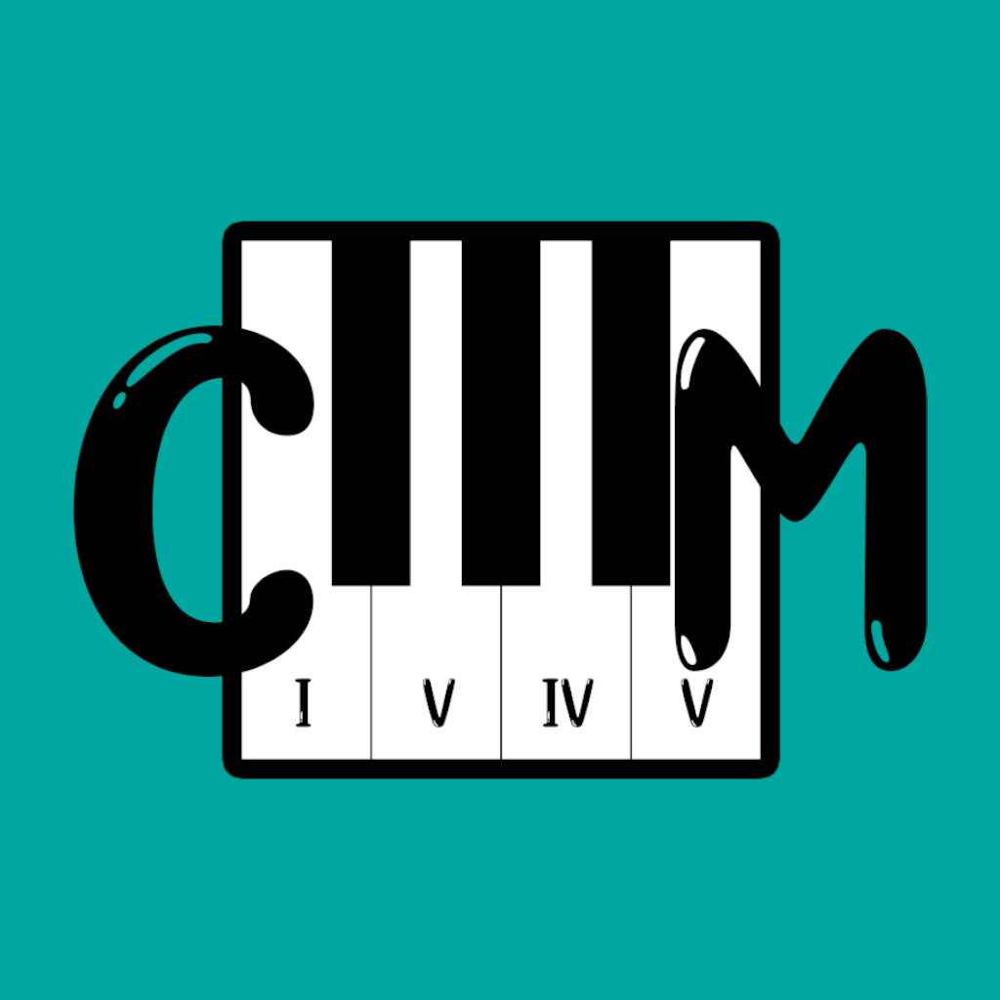
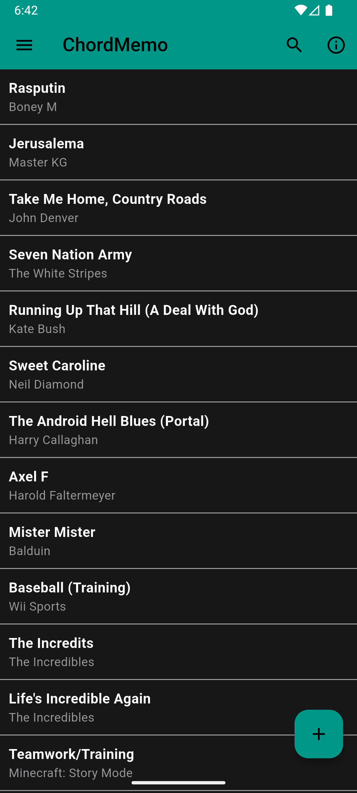
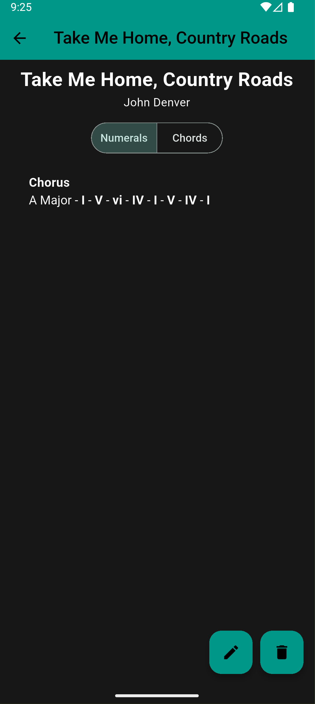
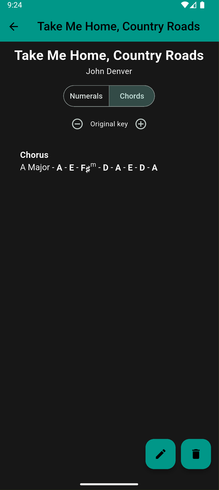
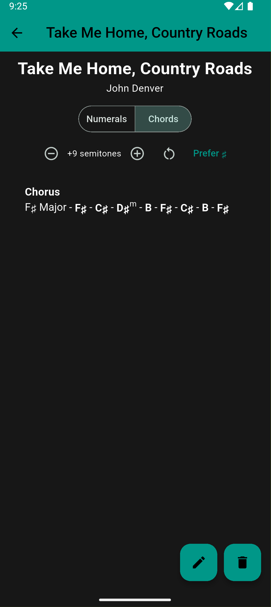
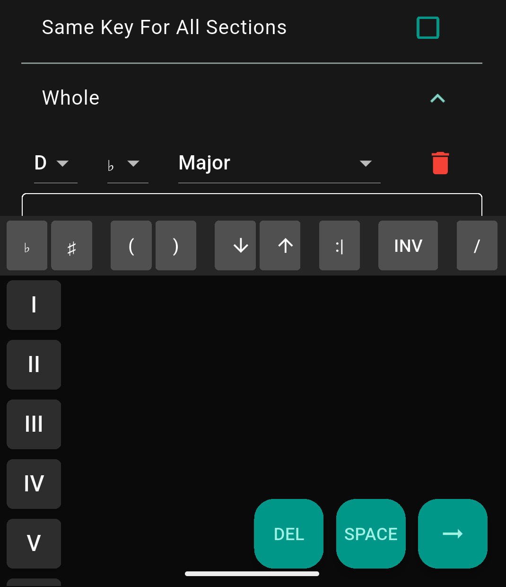
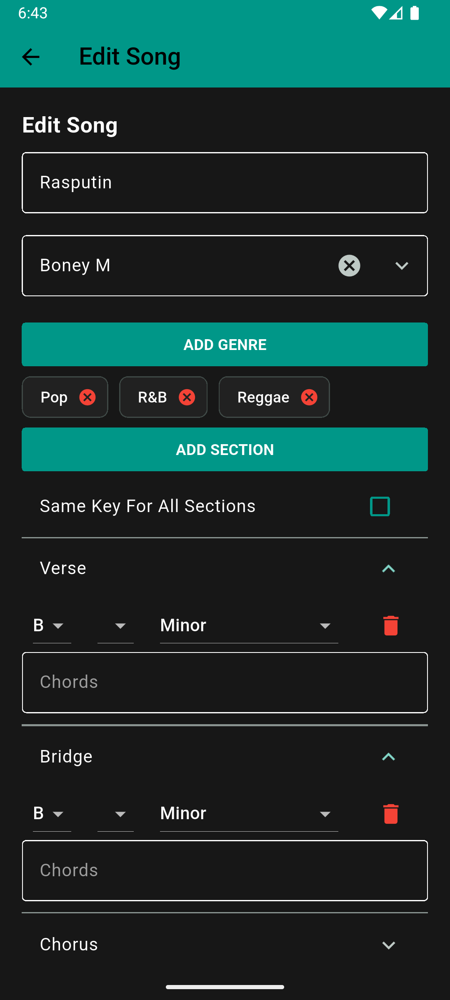

# ChordMemo

**Capture, organize, and understand chord progressions.**

ChordMemo is a Flutter app for musicians and songwriters who think in *functional
harmony*. Instead of storing letter chords, it stores progressions as
**Roman-numeral notation relative to a key** (`ii-V-I`, `I-vi-IV-V`,
`i-III-iv :2`). Because the notation is key-independent, ChordMemo can then show
you the same progression as concrete chords in **any** key, on demand — nothing
is ever rewritten.

🌐 [joshsj89.github.io/ChordMemo](https://joshsj89.github.io/ChordMemo)

---


## Screenshots


| Your songs                         | Roman numerals                                  | Concrete chords                                         |
| ---------------------------------- | ----------------------------------------------- | ------------------------------------------------------- |
|  |  |  |


| Transpose to any key                        | Custom chord keyboard                             | Editing a song                       |
| ------------------------------------------- | ------------------------------------------------- | ------------------------------------ |
|  |  |  |


---


## Features


### Store & organize

- **Songs → sections → progressions.** Each section carries its own musical key
(tonic + accidental + mode) and a chord progression.
- **13 keys/modes** — major, the three minors, the church modes, pentatonics,
Lydian Dominant, Phrygian Dominant.
- **Tag by genre**, with 19 built-ins plus your own.
- **Reorderable sections** and an optional "same key for all sections" shortcut.
- **Search** by title, artist, genre, key, or by the chords themselves.
- **Export / import** your whole library as JSON, or paste a progression
straight into a section (it's validated before it lands).


### A chord keyboard built for the notation

Progressions aren't typed as free text — a **cascading on-screen keyboard**
walks you from Roman numeral → triad quality → 7th → 9th → 11th → 13th, plus
inversions, slash chords, accidentals, parenthetical grouping, repeat bars, and
key-change tokens. Every entry is parsed live; invalid input can't be saved.

### See it as real chords, in any key

On the song screen, flip from **Numerals** to **Chords**:

- Roman numerals resolve to concrete chord symbols spelled for the section's key
(`ii⁷-V⁷-Iᐟ` → `Dm7 - G7 - Cmaj7`).
- **Transpose** the whole song up or down by semitones — every section's key
label and every chord follows.
- Ambiguous keys (F♯ vs G♭) get a **♯ / ♭ preference toggle** so the spelling
matches how you read.
- All of this is **view-only** — your stored progressions never change.


### Light & dark

System-following theme by default, with an explicit override in Settings.

---


## The notation, briefly


| You write       | It means                                         |
| --------------- | ------------------------------------------------ |
| `I-vi-IV-V`     | a I–vi–IV–V progression                          |
| `ii7-V7-IM7`    | a ii–V–I with sevenths (`Dm7 - G7 - Cmaj7` in C) |
| `V7♭9`, `viiø7` | altered / jazz qualities                         |
| `I/3`           | first inversion (3rd in the bass)                |
| `V7/V`          | a secondary chord — "the V7 **of** V"            |
| `i-III-iv :2`   | repeat that phrase twice                         |
| `I K+M2 I`      | modulate up a major 2nd partway through          |
| `(V/5-I)`       | a parenthesised sub-phrase                       |


A hand-written tokenizer and recursive-descent parser
(`[lib/model/token.dart](lib/model/token.dart)`,
`[lib/model/parser.dart](lib/model/parser.dart)`) turn this into an AST that
drives validation, the pretty renderer, and the concrete-chord speller.

---


## Running from source

Requires the [Flutter SDK](https://docs.flutter.dev/get-started/install)
(3.44+ / Dart 3.12+).

```bash
git clone https://github.com/joshsj89/ChordMemoFlutter.git
cd ChordMemoFlutter
flutter pub get
flutter run
```

The app reads one bundled asset, `.env`, which only holds a `DONATE_LINK` URL.
Create it at the project root before the first run:

```bash
echo 'DONATE_LINK=https://example.com' > .env
```

Primary targets are **Android** and **iOS**; the project also builds for web and
desktop.

### Tests & analysis

```bash
flutter test        # unit + widget tests
flutter analyze
```

The chord-notation core (tokenizer, parser, validator, transposition/spelling
engine, persistence) has close unit coverage; `test/_fixtures.dart` holds the
canonical corpus of valid progressions.

---


## How it's built


|                     |                                                                             |
| ------------------- | --------------------------------------------------------------------------- |
| **Framework**       | Flutter (Material 3)                                                        |
| **State**           | `setState` + a single `provider` for settings                               |
| **Storage**         | `shared_preferences` (versioned JSON via `SongRepository`)                  |
| **Notation engine** | pure Dart — tokenizer, recursive-descent parser, AST                        |
| **Music theory**    | pure Dart `Note` / scale / transpose model in `lib/model/music_theory.dart` |


---


## Author

Built by **Josh Kindarara** ([@joshsj89](https://github.com/joshsj89)).

This repository does not currently include an open-source license; all rights
are reserved by the author.